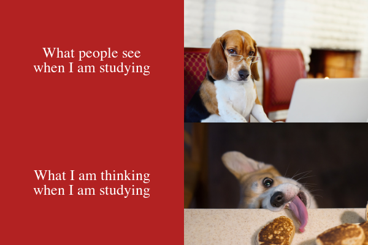

# Hello online world!

Welcome to my first github repository. 👋🏻


#### Introduction

I am a second year statistics 📊 and psychology 🧠 student at the [University of Auckland](https://www.auckland.ac.nz/en.html), and I am using github to help me with my assignments.

## My Meme

Here is a meme I made!



*It was made using the magick package on R Studios*.

### My inspiration

I was finding it very hard to get inspired for my meme. I was staring at my computer trying to think of an idea, when all that was going through my mind was how much I wanted to have a break and go get food... and **there was my inspiration**.

This was a perfect meme for me because I love:
- dogs 🐶
- food 🍕
- not studying

Here is my `R` code for my meme!

```r
url1 <- "https://media.istockphoto.com/photos/dog-working-comfortably-from-home-picture-id170462856?b=1&k=20&m=170462856&s=170667a&w=0&h=q4T88TpwMaYJEtvWxW9LthcgWP925UrL4C4D2DlURTI="
pic1 <- image_read(url1)%>%
  image_scale(300)

url2 <- "https://media.istockphoto.com/photos/corgi-tries-to-eat-a-patty-picture-id1297491530?b=1&k=20&m=1297491530&s=170667a&w=0&h=HMkdtnLq5GdhwpDYl7vUKN_QpaAuIsSMjvayniAn3TY="
pic2 <- image_read(url2)%>%
  image_scale(300)

text1 <- image_blank(width = 300, height = 200, color = "#B22222")%>%
  image_annotate(text = "What people see\nwhen I am studying", color = "#FFFFFF", size = 24, font = "Times New Roman", gravity = "center")

text2 <- image_blank(width = 300, height = 200, color = "#B22222")%>%
  image_annotate(text = "What I am thinking\nwhen I am studying", color = "#FFFFFF", size = 24, font = "Times New Roman", gravity = "center")

pic_vector <- c(text1, pic1)
top_row <- image_append(pic_vector)

text_vector <- c(text2, pic2)
bottom_row <- image_append(text_vector)

meme_vector <- c(top_row, bottom_row)
meme <- image_append(meme_vector, stack = TRUE)

```
